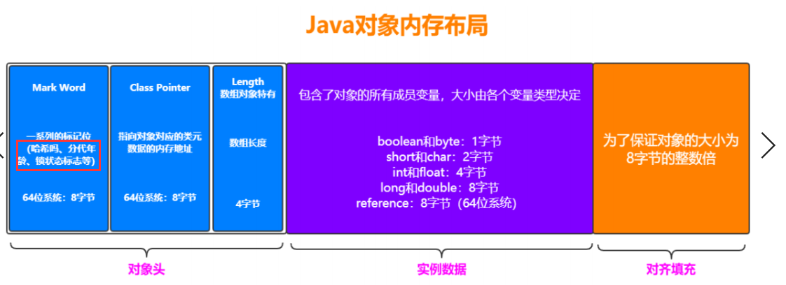
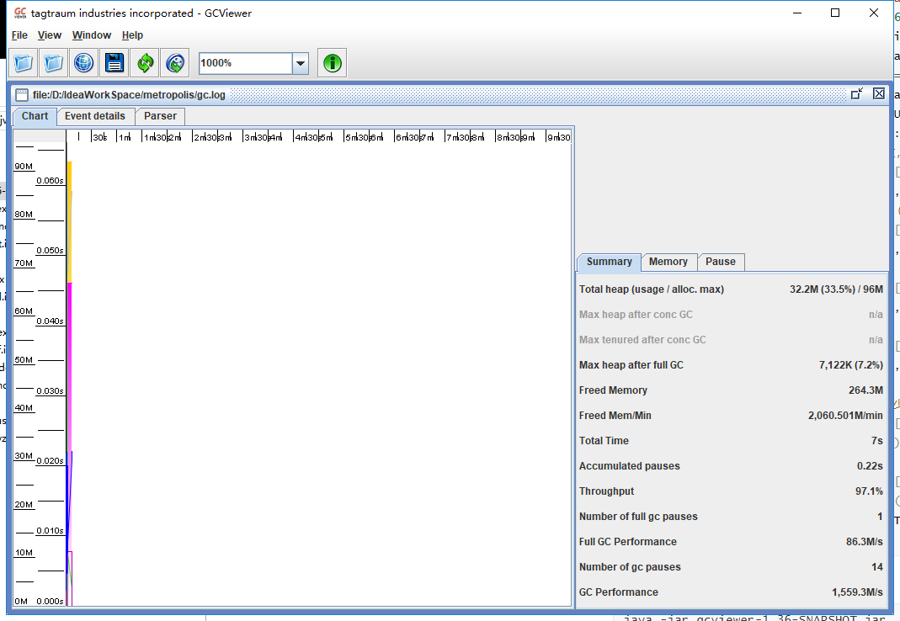
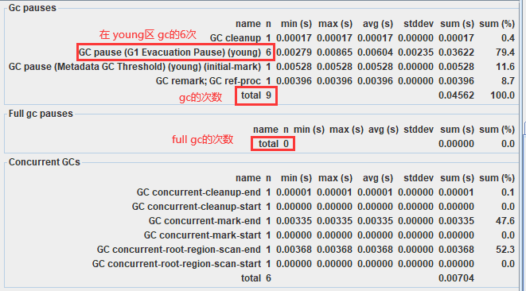

### JVM


JVM 在java体系所占的位置。

<https://docs.oracle.com/javase/8/docs/index.html>


简单的案例是，我们使用`javac`将一个`.java`编译成`.class`文件。

```java
public class Person{
	
	private String name;
	private String age;
	
	public String toString(){
		return name +" "+age;
	}
	
	public Person(String name,String age){
		this.age= age;
		this.name=name;
	}
	
	public static void main(String[] args){
		System.out.println(new Person("Pop","18"));
	}
	
}
```


用于直接使用文本打开会出现乱码，所以我们使用可以打开二进制文件的工具。`Sublime Text`

```
cafe babe 0000 0034 0036 0700 1d0a 0001
001e 0900 0a00 1f0a 0001 0020 0800 2109
000a 0022 0a00 0100 230a 000f 001e 0900
2400 2507 0026 0800 2708 0028 0a00 0a00
290a 002a 002b 0700 2c01 0004 6e61 6d65
0100 124c 6a61 7661 2f6c 616e 672f 5374
7269 6e67 3b01 0003 6167 6501 0008 746f
5374 7269 6e67 0100 1428 294c 6a61 7661
2f6c 616e 672f 5374 7269 6e67 3b01 0004
436f 6465 0100 0f4c 696e 654e 756d 6265
7254 6162 6c65 0100 063c 696e 6974 3e01
0027 284c 6a61 7661 2f6c 616e 672f 5374
7269 6e67 3b4c 6a61 7661 2f6c 616e 672f
5374 7269 6e67 3b29 5601 0004 6d61 696e
0100 1628 5b4c 6a61 7661 2f6c 616e 672f
5374 7269 6e67 3b29 5601 000a 536f 7572
6365 4669 6c65 0100 0b50 6572 736f 6e2e
....
```

class的文件结构

<https://docs.oracle.com/javase/specs/jvms/se8/html/jvms-4.html#jvms-4.1>

```java
/*
 u1表示二个十六进制位
 
 以上面的作为例子，
 cafe babe 下面标注的是 u4，代表u1*4=u4 也就是 八个十六进制，这个是class的规定的
 固定开头，称为魔术位。
*/

ClassFile {
    u4             magic;
    u2             minor_version;//最小版本
    u2             major_version;//最大版本
    u2             constant_pool_count;//常量池数量
    cp_info        constant_pool[constant_pool_count-1];
    u2             access_flags;
    u2             this_class;
    u2             super_class;
    u2             interfaces_count;
    u2             interfaces[interfaces_count];
    u2             fields_count;
    field_info     fields[fields_count];
    u2             methods_count;
    method_info    methods[methods_count];
    u2             attributes_count;
    attribute_info attributes[attributes_count];
}
```

#### 类加载机制

[Loading, Linking, and Initializing](https://docs.oracle.com/javase/specs/jvms/se8/html/jvms-5.html)

`.class`文件到JVM的过程

- 装载（loading）
  - 首先找到`.class`文件所在位置，可能是磁盘也可能是网络，`类装载器ClassLoader`
    - 

    - 1）`Bootstrap ClassLoader` 负责加载$JAVA_HOME中 jre/lib/rt.jar 里所有的class或 Xbootclassoath选项指定的jar包。由C++实现，不是ClassLoader子类。

    -  2）`Extension ClassLoader` 负责加载java平台中扩展功能的一些jar包，包括$JAVA_HOME中 jre/lib/*.jar 或 -Djava.ext.dirs指定目录下的jar包。

    -  3）`App ClassLoader` 负责加载classpath中指定的jar包及 Djava.class.path 所指定目录下的类和 jar包。 

    - 4）`Custom ClassLoader` 通过java.lang.ClassLoader的子类自定义加载class，属于应用程序根据 自身需要自定义的ClassLoader，如tomcat、jboss都会根据j2ee规范自行实现ClassLoader。

    - 利用双亲委派，来保证类加载器加载到jvm只有一个全路径的class对象，先去父亲加载器寻找，如果找不到就往下找，如果都没有，就自己加载。

    - 如何破坏双亲委派。

    - ```java
      // 继承后，重写这个方法，达到破坏 
      // ClassLoader.java
      protected Class<?> loadClass(String name, boolean resolve)
              throws ClassNotFoundException
          {
              synchronized (getClassLoadingLock(name)) {
                  // First, check if the class has already been loaded
                  // 判断这个class是不是早已加载。
                  Class<?> c = findLoadedClass(name);
                  if (c == null) {
                      long t0 = System.nanoTime();
                      try {
                          if (parent != null) {
                              c = parent.loadClass(name, false);//不断往上寻找
                          } else {
                              c = findBootstrapClassOrNull(name);
                          }
                          
      // MyClassLoader.java
      /**
       * @author Pop
       * @date 2020/2/9 21:38
       */
      public class MyClassLoader extends ClassLoader {
          @Override
          public Class<?> loadClass(String name) throws ClassNotFoundException {
              return null;
          }
      }
      
      ```

  - 类文件的信息交给JVM--->不是全部加载，而是将class中的信息，分别存储到不同区域，方法区和堆
  - 类文件所对应的对象class->JVM

- 链接（linking）

  - 验证 （Verify）

    - 保证被加载类的正确性
      - 文件格式验证
      - 元数据验证
      - 字节码验证
      - 符号引用验证

  - 准备 ( Prepare)

    - 为类的静态变量分配内存，并将其初始化为默认值
    - static int a = 10;  --> 先初始化为 0

  - 解析 （ Resolve）

    - 把类中的符号引用转换为直接引用

      - 符号引用，在javac命令编译java文件变成class文件的时候，会产生一个全是十六进制内容的class文件，class文件中含有许多有标志性意义的符号，例如

      - ```java
        ClassFile {
            u4             magic;
            u2             minor_version;//最小版本
            u2             major_version;//最大版本
            u2             constant_pool_count;//常量池数量
            cp_info        constant_pool[constant_pool_count-1];
            u2             access_flags;// 类似这种，符号引用
            u2             this_class;
            u2             super_class;
            u2             interfaces_count;
            u2             interfaces[interfaces_count];
            u2             fields_count;
            field_info     fields[fields_count];
            u2             methods_count;
            method_info    methods[methods_count];
            u2             attributes_count;
            attribute_info attributes[attributes_count];
        }
        ```

      - 他加载到jvm中的时候，变成jvm有意义的内存地址，就是class format，所以我们toString没有重写的话，就会有@6X4F44类似这样的地址。

- 初始化（initializing）

  - 为静态变量初始化真正的值
  - static int a = 0->10


class文件装载到JVM后，JVM会有这样一块区域，用来存储class的信息。

https://docs.oracle.com/javase/specs/jvms/se8/html/jvms-2.html


* **Method Area** :它存储每个**类的结构**，如**运行时常量池**、静态变量，字段和方法数据，以及方法和构造函数的代码，包括在类和实例初始化以及接口初始化中使用的特殊方法，**方法区只有一个，所有线程共享的，非线程安全。生命周期和虚拟机一样**。

* JDK1.7: PermSpace--->永久代
  JDK1.8: MetaSpace---> 元空间

  ```java
  The method area is created on virtual machine start-up.
      // 方法区随着虚拟机启动而创建
      Although the method area is logically part of the heap,
  	// 虽然方法区逻辑上属于堆的一部分
  simple implementations may choose not to either garbage collect or compact it.
      // 垃圾回收不太讨论方法的垃圾回收
      If memory in the method area cannot be made available to satisfy an allocation request, the Java Virtual Machine throws an OutOfMemoryError.
      // 如果方法区没有足够的空间了，那么jvm就会报出 内存溢出异常
  ```

* **Heap** : Java虚拟机有一个在所有Java虚拟机线程之间共享的堆。堆是为所有类**实例和数组分配内存的运行时数据区域**。堆是在虚拟机启动时创建的。对象的堆存储由自动存储管理系统(称为垃圾收集器)回收;对象从不显式释放。Java虚拟机假设没有特定类型的自动存储管理系统，可以根据实现者的系统需求选择存储管理技术。堆的大小可以是固定的，也可以根据计算的需要进行扩展，如果不需要更大的堆，则可以收缩。堆的内存不需要是连续的。

  ```java
  The Java Virtual Machine has a heap that is shared among all Java Virtual Machine threads. The heap is the run-time data area from which memory for all class instances and arrays is allocated.
  // 堆也只有一个，被所有线程共享，非线程安全，生命周期和虚拟机一样，存储对象实例和数组
  If a computation requires more heap than can be made available by the automatic storage management system, the Java Virtual Machine throws an OutOfMemoryError.
      // 如果空间不够，jvm会抛出内存溢出异常
  ```

* **Java Virtual Machine Stacks** ： 可以看出 Method Area 和 Heap 已经将class的信息都存储起来，那么这个区域代表了一个数据结构（栈），先进后出，表示线程调用方法的模型，调用方法时候压栈，低啊用完毕出栈，也就是线程执行方法的表示。上面两个是共享的区域，但是下面就是**每个线程私有**的，每个线程在调用方法时会存在的结构。
  * 

  * ```java
    If the computation in a thread requires a larger Java Virtual Machine stack than is permitted, the Java Virtual Machine throws a StackOverflowError.
        // 栈的深度不够了，就抛出 StackOverflowError
    f Java Virtual Machine stacks can be dynamically expanded, and expansion is attempted but insufficient memory can be made available to effect the expansion, or if insufficient memory can be made available to create the initial Java Virtual Machine stack for a new thread, the Java Virtual Machine throws an OutOfMemoryError.   
    ```

  * `javap`对class文件编译字节码指令，或者 `javap -c Person.class > Person.txt` 导出txt文件。

  * ```java
    public staic int cal(int i,int i2){
        op1 = 3;
        int result = i+i2;
        //Object o = obj;
        return result;
    }
    ```

  * 方法的执行：Frame代表一个栈帧，在一个栈帧中存在，返回值地址

    * Local Variables ： 本地常量表

    * Operand Stacks ： 操作数栈

      * 包含具体数字的计算的压栈和计算完成的出栈

    * Dynamic Linking：动态链接，部分class类型是无法在非运行时期确定的，例如泛型，多态，在正在运行调用的时候才可以确定具体类型。

    * Invocation Completion：调用完成

    * 

    * https://docs.oracle.com/javase/specs/jvms/se8/html/index.html，字节码的意义的解读

    * ```java
      Compiled from "Person.java" 
      class Person { 
      ... public static int calc(int, int); 
          Code:
          	0: iconst_3 //将int类型常量3压入[操作数栈] 
              1: istore_0 //将int类型值存入[局部变量0] 
              2: iload_0 //从[局部变量0]中装载int类型值入栈 
              3: iload_1 //从[局部变量1]中装载int类型值入栈 
              4: iadd //将栈顶元素弹出栈，执行int类型的加法，结果入栈 【For example, the iadd instruction (§iadd) adds two int values together. It requires that the int values to be added be the top two values of the operand stack, pushed there by previous instructions. Both of the int values are popped from the operand stack. They are added, and their sum is pushed back onto the operand stack. Subcomputations may be nested on the operand stack, resulting in values that can be used by the encompassing computation.】 
              5: istore_2 //将栈顶int类型值保存到[局部变量2]中 
              6: iload_2 //从[局部变量2]中装载int类型值入栈 
              7: ireturn //从方法中返回int类型的数据 
          ... 
      }
      ```

    * 

    * **局部变量表**指向**堆**

      ```java
      public int test(int i){
          int result = i+6;
          // obj会存在局部变量表，对象实例存在于 堆
          Object obj = new Object();
          return result;
      }
      ```

      

    * **方法区**指向**堆**

      ```java
      public static Object obj = new Object();
      // 由于静态变量是存在于 方法区的，对象实例存在堆
      ```

      

    * **堆**指向**方法区**

      ```java
      // 我们知道 对象实例与数组是存在于堆中的，方法区是存储的class的结构信息
      new Person();//假设我们new了一个Person对象，很明显，他是存在于堆里的，问题是jvm是如何知道他是Person类型的，是由按照Person.class创建出来的？
      // 这就涉及到了Java对象内存布局
      ```

      从上面我们可以看出，`ClassPointer`就是指向了是谁创建的信息。也就是**堆指向方法区**。
      

* **Native Method Stack**：代表了 java 中的 naive修饰的方法，调用的c的stack

* **The pc Register**

  * 我们都知道一个JVM进程中有多个线程在执行，而线程中的内容是否能够拥有执行权，是根据 

    CPU调度来的。 

    假如线程A正在执行到某个地方，突然失去了CPU的执行权，切换到线程B了，然后当线程A再获 

    得CPU执行权的时候，怎么能继续执行呢？这就是需要在线程中维护一个变量，记录线程执行到 

    的位置。 程序计数器占用的内存空间很小，由于Java虚拟机的多线程是通过线程轮流切换，并分配处理器执行时 

    间的方式来实现的，在任意时刻，一个处理器只会执行一条线程中的指令。因此，为了线程切换后能够 

    **恢复到正确的执行位置**，每条线程需要有一个独立的程序计数器(线程私有)。 

    如果线程正在执行Java方法，则计数器记录的是正在执行的虚拟机字节码指令的地址； 

    如果正在执行的是Native方法，则这个计数器为空。


#### JVM的内存模型

个人理解的JVM内存模型，由于虚拟机栈和其他区域都是线程私有的，则意味着JVM中如果线程不调用方法，这些结构是不存在的，而**方法区**和**堆**不一样的，他们的生命周期和JVM是相同的，所以当JVM启动的时候，这些区域的内存就已经分配，所以拿这两块来当做JVM的内存模型。MetaSpace和Heap


* Old区

  * 当一个java对象经过15次(默认)次垃圾回收仍然存活，会被转移到Old区。
  * 一个对象创建的时候过大（100M），会被直接转移到Old区

* Eden+S0+S1

  * GC最频繁的区域
  * S0与S1存在的意义在于对象放在Eden区时候，由于垃圾回收导致存储**不连续**，S0和S1轮流整理这些碎片来保证内存连续，空出更多的空间去存放其它区，S0和S1在同一时间必有一个是空的，这是一种牺牲。
  * 比例上来说，S0**[From]**与S1**[To]**是相同大小，Eden区域分摊剩下的部分，例如Young区是100M，Eden为80M，S0和S1都是10M。Eden:S0:S1=8:1:1
  * 当S0或S1分配空间不够，会向Old区借用一些空间，成为**担保机制**。
  * 

  


* Young GC [包含了Eden，S区]：Minor GC
* Old GC ：Major GC，MajorGC通常会伴随着MinorGC，差不多类似Full GC
* Young+Old：Full GC 可能还会伴随着 MetaSpace区域GC
* 由于Full GC会带来较长的STW，所以要尽量减少Full GC的频率

#### 垃圾回收

* 一个对象什么时候算作垃圾

  * 引用计数，会有循环引用的问题

  * 可达性分析，GC Root，由它出发，某个对象是否可达。

    * GC Root在Java进程需要很长时间存在，生命周期足够长，不然一下就被回收了作为	Root就没意义了。

    * 可作为CGRoot : 类加载器、Thread、虚拟机栈的本地变量表、static成员、常量引用、本地方法 

      栈的变量等。 

垃圾回收中的吞吐量：用户时间/(用户时间+GC时间)

##### 回收算法

当一个对象已经确定是垃圾的时候，采用何种方式进行回收。


###### 标记清除（Mark-Sweep）


先标记，后清除。

```
标记清除之后会产生大量不连续的内存碎片，空间碎片太多可能会导致以后在程 序运行过程中需要分配较大对象时，无法找到足够的连续内存而不得不提前触发另一次垃圾收集动作。 
(1)标记和清除两个过程都比较耗时，效率不高 
(2)会产生大量不连续的内存碎片，空间碎片太多可能会导致以后在程序运行过程中需要分配较大对象时，无 法找到足够的连续内存而不得不提前触发另一次垃圾收集动作。
```

###### 复制 （Copying）

为了解决空间的碎片的问题，我们可以参考young区S0和S1的设计，分成两个区域，浪费一半的区域来获得整理的能力。


左边有垃圾的时候，将活跃对象复制到另一边，复制到另一边的时候便是连续的，左边就可以大胆的全部清空。就会变成上图的样子，左边干净，右边内存连续。

```
空间利用率降低。
```

###### 标记整理（**Mark-Compact**）

标记过程仍然与"标记-清除"算法一样，但是后续步骤不是直接对可回收对象进行清理，而是让所有存活的对象都向一端移动，然后直接清理掉端边界以外的内存。


让所有存活的对象都向一端移动，清理掉边界意外的内存。


###### 算法的具体落地->垃圾收集器

https://docs.oracle.com/javase/8/docs/technotes/guides/vm/gctuning/toc.html

不同的垃圾收集器也作用于不同的年龄代。


撇开垃圾收集器不谈，不同的年龄代适用于什么垃圾回收算法。

* 新生代
  * 适用于复制算法，由于Eden区域需要将存活的对象复制到S1或者S0，来达到内存整理的目的，那么复制的对象不应该过多，不然损耗的性能会比较大。又由于新生代的对象大多数都是朝生夕死，也就意味着需要复制的对象比较少，所以适用于**复制算法**。
* 老年代
  * 老年代不适用于赋值算法，一个是，老年代存在的大小过大的对象，又或者是年龄大于15的对象，所以老年代的对象会存在一种多且大的情况，赋值算法都是比较耗时的，所以适用于**标记整理**或者**标记清除**

垃圾收集器的几个维度

* 单线程/多线程
* 采用什么算法
* 作用于什么代
* 优缺点

例如，Serial垃圾收集器是单线程，采用复制算法，作用于新生代，缺点是单线程可能效率第一点。

垃圾收集器中，需要额外关注的是CMS和G1，其它的区别只是**单线程，多线程，多线程关注吞吐量的**。

###### CMS：Concurrent Mark Sweep 并发垃圾收集器

```java
The Concurrent Mark Sweep (CMS) collector is designed for applications that prefer shorter garbage collection pauses and that can afford to share processor resources with the garbage collector while the application is running. 
//更短的暂停时间 https://docs.oracle.com/javase/8/docs/technotes/guides/vm/gctuning/cms.html#concurrent_mark_sweep_cms_collector

```

比较关注**停顿时间**。

采用的是"标记-清除算法",整个过程分为4步

```
(1)初始标记 CMS initial mark 标记GC Roots能关联到的对象 Stop The World-- ->速度很快 
(2)并发标记 CMS concurrent mark 进行GC Roots Tracing 
(3)重新标记 CMS remark 修改并发标记因用户程序变动的内容 Stop The World 
(4)并发清除 CMS concurrent sweep 优点：并发收集、低停顿 缺点：产生大量空间碎片
```


###### G1 

```java
The Garbage-First (G1) garbage collector is a server-style garbage collector, targeted for multiprocessor machines with large memories. It attempts to meet garbage collection (GC) pause time goals with high probability while achieving high throughput. Whole-heap operations, such as global marking, are performed concurrently with the application threads. This prevents interruptions proportional to heap or live-data size.
/*
garbage - first (G1)垃圾收集器是一种服务器风格的垃圾收集器，目标是具有大内存的多处理器机器。它“试图”在实现高吞吐量的同时，以高概率实现垃圾收集(GC)暂停时间目标。整个堆操作(例如全局标记)是与应用程序线程并发执行的。这可以防止与堆或实时数据大小成比例的中断。
https://docs.oracle.com/javase/8/docs/technotes/guides/vm/gctuning/g1_gc.html#garbage_first_garbage_collection
*/
```

> 使用G1收集器时，Java堆的内存布局与就与其他收集器有很大差别，它将整个Java堆划分为多个 大小相等的独立区域（Region），虽然还保留有新生代和老年代的概念，但新生代和老年代不再 是物理隔离的了，它们都是一部分Region（不需要连续）的集合。

```
初始标记（Initial Marking） 标记一下GC Roots能够关联的对象，并且修改TAMS的值，需要暂 停用户线程 
并发标记（Concurrent Marking） 从GC Roots进行可达性分析，找出存活的对象，与用户线程并发 
执行最终标记（Final Marking） 修正在并发标记阶段因为用户程序的并发执行导致变动的数据，需 暂停用户线程 
筛选回收（Live Data Counting and Evacuation） 对各个Region的回收价值和成本进行排序，根据 用户所期望的GC停顿时间制定回收计划
```


G1重新对堆进行了布局，为了适用于G1垃圾收集器，按照`Region`，Young和Old只是逻辑上的连续。


H表示大对象，S表示Survivor区的内存，他们虽然逻辑上是连续的，也就是S0或S1区确实是存储了数据，但是在上面真实的内容布局中，其实已经被划分成了一块一块的Region独立区域。为何适合G1垃圾收集器。

同时，Region区域可以监控自己区域的使用情况，使用率，还有内部对象大小，然后G1可以根据这些情况来**决定是否回收**，例如太大了，可能回收起来比较麻烦，就下一次再说。

> JDK 7开始使用，JDK 8非常成熟，JDK 9默认的垃圾收集器，适用于新老生代。

判断是否需要使用G1收集器？

```
（1）50%以上的堆被存活对象占用 
（2）对象分配和晋升的速度变化非常大 
（3）垃圾回收时间比较长
```

##### JVM 调优 阶段性小结

对于JVM调优有一个是垃圾收集器的选择

而垃圾收集器有两个维度是比较常用的。停顿时间和吞吐量

* **停顿时间**：停顿时间过长会导致用户线程等待过长，在web程序中相当于用户请求的响应时间过程，我们不希望让用户等待时间太久，时间短可以让用户获得更好的体验，用户的交互也越多，那我们可以选择停段时间小的垃圾收集器
  * CMS、G1[set pause time,not strict 可以设置很短停顿时间，但是不要太严格，不然会频繁触发GC]，他们属于**并发类的收集器**
* **吞吐量**：运行用户代码时间/（运行用户代码时间+垃圾收集时间），则意味着用户代码执行任务占用CPU的时间较长，由于跑任务，运算这些并不怎么需要创建对象和占有内存资源，更多是占用CPU资源，所以更适用于后台跑批任务的程序。
  * Paralled Scanvent(作用于新生代，并行，注重吞吐量的垃圾收集器)+Paralled Old(作用于老年代，并行，注重吞吐量的垃圾收集器) 属于**并行类的收集器**。
* **串行收集**
  * Serial 和 Serial Old 适用于内存比较小，嵌入式的设备

##### 如何查看你的java进程正在什么垃圾收集器

首先启动一个java进程

```
jps -l
```

列出所有的java进程，找到pid


```
jinfo -flag UseG1GC 16604
```

查看是否使用了G1收集器


减号，代表没有使用，加号代表正在使用，很明显，这个java进程没有使用G1垃圾收集器。如果你不记得了具体参数名字可以输入

```
jinfo -flags 16604
```

打印出全部JVM参数。


```java
Attaching to process ID 16604, please wait...
Debugger attached successfully.
Server compiler detected.
JVM version is 25.202-b08
Non-default VM flags: 
-XX:-BytecodeVerificationLocal 
-XX:-BytecodeVerificationRemote 
-XX:CICompilerCount=3 
-XX:InitialHeapSize=268435456 
-XX:+ManagementServer 
-XX:MaxHeapSize=4286578688 
-XX:MaxNewSize=1428684800 
-XX:MinHeapDeltaBytes=524288 
-XX:NewSize=89128960 
-XX:OldSize=179306496 
-XX:TieredStopAtLevel=1 
-XX:+UseCompressedClassPointers 
-XX:+UseCompressedOops 
-XX:+UseFastUnorderedTimeStamps 
-XX:-UseLargePagesIndividualAllocation 
-XX:+UseParallelGC //使用的ParalledGC
Command line:  -agentlib:jdwp=transport=dt_socket,address=127.0.0.1:44529,suspend=y,server=n -XX:TieredStopAtLevel=1 -Xverify:none -Dspring.output.ansi.enabled=always -Dcom.sun.management.jmxremote -Dcom.sun.management.jmxremote.port=44526 -Dcom.sun.management.jmxremote.authenticate=false -Dcom.sun.management.jmxremote.ssl=false -Djava.rmi.server.hostname=localhost -Dspring.liveBeansView.mbeanDomain -Dspring.application.admin.enabled=true -javaagent:C:\Users\99405\.IntelliJIdea2018.3\system\captureAgent\debugger-agent.jar -Dfile.encoding=UTF-8
```

```
（1）串行 -XX：+UseSerialGC -XX：+UseSerialOldGC 
（2）并行(吞吐量优先)： -XX：+UseParallelGC -XX：+UseParallelOldGC 
（3）并发收集器(响应时间优先) -XX：+UseConcMarkSweepGC -XX：+UseG1G咕
```

##### JVM参数

* 标准参数：不会随着JDK版本的变化而变化
  * java -version/-help
* -X参数
  * 非标准参数，会随着JDK版本的变化而变化
  * -Xint
* -XX参数
  * Boolean 类型
    * -XX:[+/-]name 启动或者停止
  * 非Boolean类型
    * -XX:name = value
    * -XX:MaxHeapSize=100M
* 其它参数[-XX参数]
  * -Xms100M  等同于 -XX:InitialHeapSize=100M
  * -Xmx100M  等同于 -XX:MaxHeapSize=100M
  * -Xss100k  等同于 -XX:ThreadStackSize=100k

例如某个java进程中，想要打印出所有的参数，可以在虚拟机参数中加入

```
-XX:+PrintFlagsFinal
```


系统启动的时候，就会打印出这些参数


设置堆最大内存和初始化内存大小为100M


所以这里显示的是字节(Byte)为单位，前面有个冒号，表示被修改过。

##### 知道参数后如何修改

* idea、eclipse中直接配置，和上面一样

* 在启动jar包的时候，在前面加上参数

  ```
  java -XX:+UseG1GC xxx.jar
  ```

* 例如在某个`.sh`里面增加JVM参数，像tomcat的bin文件夹下的catalina.sh中

* 实时修改，jinfo修改，但是要支持适时修改的参数才可以利用jinfo实时修改。尾缀是manageable才支持动态修改

  * jinfo -flag name=value PID
  * 

| 参数                                                         | 含义                                                         | 说明                                                         |
| ------------------------------------------------------------ | ------------------------------------------------------------ | ------------------------------------------------------------ |
| -XX:CICompilerCount=3                                        | 最大并行编译数                                               | 如果设置大于1，虽然编译速度会提高，但是同样影响系 统稳定性，会增加JVM崩溃的可能 |
| -XX:InitialHeapSize=100M                                     | 初始化堆大小                                                 | 简写-Xms100M                                                 |
| -XX:MaxHeapSize=100M                                         | 最大堆大小                                                   | 简写-Xmx100M                                                 |
| -XX:NewSize=20M                                              | 设置年轻代的大小                                             |                                                              |
| -XX:MaxNewSize=50M                                           | 年轻代最大大小                                               |                                                              |
| -XX:OldSize=50M                                              | 设置老年代大小                                               |                                                              |
| -XX:MetaspaceSize=50M                                        | 设置方法区大小                                               |                                                              |
| -XX:MaxMetaspaceSize=50M                                     | 方法区最大大小                                               |                                                              |
| -XX:+UseParallelGC                                           | 使用UseParallelGC                                            | 新生代，吞吐量优先                                           |
| -XX:+UseParallelOldGC                                        | 使用UseParallelOldGC                                         | 老年代，吞吐量优先                                           |
| -XX:+UseConcMarkSweepGC                                      | 使用CMS                                                      | 老年代，停顿时间优先                                         |
| -XX:+UseG1GC                                                 | 使用G1GC                                                     | 新生代，老年代，停顿时间优先                                 |
| -XX:NewRatio                                                 | 新老生代的比值                                               | 比如-XX:Ratio=4，则表示新生代:老年代=1:4，也就是新 生代占整个堆内存的1/5 |
| -XX:SurvivorRatio                                            | 两个S区和Eden区的比值                                        | 比如-XX:SurvivorRatio=8，也就是(S0+S1):Eden=2:8， 也就是一个S占整个新生代的1/10 |
| -XX:+HeapDumpOnOutOfMemoryError                              | 启动堆内存溢出打印                                           | 当JVM堆内存发生溢出时，也就是OOM，自动生成dump 文件          |
| -XX:HeapDumpPath=heap.hprof                                  | 指定堆内存溢出打印目录                                       | 指定目录生成一个heap.hprof文件                               |
| XX:+PrintGCDetails - <br />XX:+PrintGCTimeStamps -<br />XX:+PrintGCDateStamps<br />Xloggc:$CATALINA_HOME/logs/gc.log | 打印出GC日志                                                 | 可以使用不同的垃圾收集器，对比查看GC情况                     |
| Xss128k                                                      | 设置每个线程的堆栈大小                                       | 经验值是3000-5000最佳                                        |
| -XX:MaxTenuringThreshold=6                                   | 提升年老代的最大临界值                                       | 默认值为 15                                                  |
| -XX:InitiatingHeapOccupancyPercent                           | 启动并发GC周期时堆内存使用占比                               | G1之类的垃圾收集器用它来触发并发GC周期,基于整个堆 的使用率,而不只是某一代内存的使用比. 值为 0 则表示”一直执行GC循环”. 默认值为 45. |
| -XX:G1HeapWastePercent                                       | 允许的浪费堆空间的占比                                       | 默认是10%，如果并发标记可回收的空间小于10%,则不 会触发MixedGC。 |
| -XX:MaxGCPauseMillis=200ms                                   | G1最大停顿时间                                               | 暂停时间不能太小，太小的话就会导致出现G1跟不上垃 圾产生的速度。最终退化成Full GC。所以对这个参数的调优是一个持续的过程，逐步调整到最佳状态。 |
| -XX:ConcGCThreads=n                                          | 并发垃圾收集器使用的线程数量                                 | 默认值随JVM运行的平台不同而不同                              |
| -XX:G1MixedGCLiveThresholdPercent=65                         | 混合垃圾回收周期中要包括的旧区域设置 占用率阈值              | 默认占用率为 65%                                             |
| -XX:G1MixedGCCountTarget=8                                   | 设置标记周期完成后，对存活数据上限为 G1MixedGCLIveThresholdPercent 的旧区域执行混合垃圾回收的目标次数 | 默认8次混合垃圾回收，混合回收的目标是要控制在此目 标次数以内 |
| \- XX:G1OldCSetRegionThresholdPercent=1                      | 描述Mixed GC时，Old Region被加入到 CSet中                    | 默认情况下，G1只把10%的Old Region加入到CSet中                |

`jstat`：class/gc

```java
jstat -class [PID] [多少秒输出一次] [输出多少次]
// class的装载和卸载信息
```


```java
jstat -gc [PID] [多少秒输出一次] [输出多少次]
// 输出 gc日志
```


`jstack`：查看线程堆栈信息

```java
jstack [PID]
// 例如可以方便排查死锁之前的问题
```


`jmap`：生成堆内存的快照

```
jmap -heap PID
```


导出dump文件：

```java
jmap -dump:format=b,file=heap.hprof [PID]
```


希望发生OOM的自动dump出快照文件。

```java
-XX:+HeapDumpOnOutOfMemoryError -XX:HeapDumpPath=heap.hprof
```


java中自带的好用的功能

java/bin

* jconsole

* jvisualvm

  * 连接远端

    * (1)在visualvm中选中“远程”，右击“添加” 

      (2)主机名上写服务器的ip地址，比如31.100.39.63，然后点击“确定” 

      (3)右击该主机“31.100.39.63”，添加“JMX”[也就是通过JMX技术具体监控远端服务器哪个Java进程] 

      (4)要想让服务器上的tomcat被连接，需要改一下 bin/catalina.sh 这个文件 

    * ```sh
      JAVA_OPTS="$JAVA_OPTS -Dcom.sun.management.jmxremote - Djava.rmi.server.hostname=31.100.39.63 -Dcom.sun.management.jmxremote.port=8998 -Dcom.sun.management.jmxremote.ssl=false - Dcom.sun.management.jmxremote.authenticate=true - Dcom.sun.management.jmxremote.access.file=../conf/jmxremote.access - Dcom.sun.management.jmxremote.password.file=../conf/jmxremote.password"
      # 密码和访问文件可以另外创建
      # jmxremote.access
      # guest readonly 配置用户名和访问权限
      # manager readwrite
      
      # jmxremote.password
      # guest guest 配置用户名和密码
      # manager manager
      
      #chmod 600 *jmxremot* 授予权限
      ```

    * 应对阿里云策略的修改（略）

分析heap.hprof工具 mat


查看gc日志

```
-XX:+PrintGCDetails -XX:+PrintGCTimeStamps -XX:+PrintGCDateStamps -Xloggc:gc.log
```

打开gc.log内容

```verilog
2014-07-18T16:02:17.606+0800（当前时间戳）: 611.633（时间戳）: [GC（表示Young GC） 611.633: [DefNew（单线程Serial年轻代GC）: 843458K（年轻代垃圾回收前的大小）->2K（年轻代回收后的大小）(948864K（年轻代总大小）), 0.0059180 secs（本次回收的时间）] 2186589K（整个堆回收前的大小）->1343132K（整个堆回收后的大小）(3057292K（堆总大小）), 0.0059490 secs（回收时间）] [Times: user=0.00（用户耗时） sys=0.00（系统耗时）, real=0.00 secs（实际耗时）]
```

```verilog
Java HotSpot(TM) 64-Bit Server VM (25.202-b08) for windows-amd64 JRE (1.8.0_202-b08), built on Dec 15 2018 19:54:30 by "java_re" with MS VC++ 10.0 (VS2010)
Memory: 4k page, physical 16740488k(8601488k free), swap 17854600k(5665416k free)
CommandLine flags: -XX:-BytecodeVerificationLocal -XX:-BytecodeVerificationRemote -XX:+HeapDumpOnOutOfMemoryError -XX:HeapDumpPath=heap.hprof -XX:InitialHeapSize=104857600 -XX:+ManagementServer -XX:MaxHeapSize=104857600 -XX:-PrintFlagsFinal -XX:+PrintGC -XX:+PrintGCDateStamps -XX:+PrintGCDetails -XX:+PrintGCTimeStamps -XX:TieredStopAtLevel=1 -XX:+UseCompressedClassPointers -XX:+UseCompressedOops -XX:-UseLargePagesIndividualAllocation -XX:+UseParallelGC //使用什么垃圾收集器
    // 第一次发生gc的原因是因为分配内存失败，对Young区进行垃圾回收 98304k是总堆大小
2020-02-11T21:14:06.253+0800: 1.403: [GC (Allocation Failure) [PSYoungGen: 25600K->3466K(29696K)] 25600K->3474K(98304K), 0.0055600 secs] [Times: user=0.00 sys=0.00, real=0.01 secs] //从 25600k回收到3466k（总大小29696k）
2020-02-11T21:14:06.529+0800: 1.678: [GC (Allocation Failure) [PSYoungGen: 29066K->4089K(29696K)] 29074K->5416K(98304K), 0.0071322 secs] [Times: user=0.03 sys=0.02, real=0.01 secs] 
2020-02-11T21:14:06.683+0800: 1.832: [GC (Allocation Failure) [PSYoungGen: 29689K->4088K(29696K)] 31016K->6921K(98304K), 0.0089296 secs] [Times: user=0.00 sys=0.00, real=0.01 secs] 
2020-02-11T21:14:06.859+0800: 2.008: [GC (Allocation Failure) [PSYoungGen: 29688K->4088K(29696K)] 32521K->9602K(98304K), 0.0064925 secs] [Times: user=0.06 sys=0.00, real=0.01 secs] 
    // MetaSpace 的垃圾回收，但是次数比较少
2020-02-11T21:14:07.190+0800: 2.340: [GC (Metadata GC Threshold) [PSYoungGen: 26551K->4072K(29696K)] 32065K->12164K(98304K), 0.0450055 secs] [Times: user=0.02 sys=0.00, real=0.04 secs] 
2020-02-11T21:14:07.235+0800: 2.385: [Full GC (Metadata GC Threshold) [PSYoungGen: 4072K->0K(29696K)] [ParOldGen: 8092K->7122K(68608K)] 12164K->7122K(98304K), [Metaspace: 20589K->20587K(1067008K)], 0.0570488 secs] [Times: user=0.03 sys=0.00, real=0.06 secs] 
//...
```

**注意** 如果回收的差值中间有出入，说明这部分空间是Old区释放出来的

使用工具查看gc日志，`gcviewer`

```
java -jar gcviewer-1.36-SNAPSHOT.jar
```



关注吞吐量和停顿时间。


在线工具，http://gceasy.io

##### JVM调优实战

比较不同的垃圾收集器的效率。

评价一个垃圾收集器的好坏，**停顿时间、吞吐量、GC次数**

使用CMS垃圾收集器，由于CMS是老年代的收集器，所以Old的垃圾收集器被他取代

```
-XX:+UseConcMarkSweepGC
```

使用cms后的垃圾收集器的日志

```verilog
Java HotSpot(TM) 64-Bit Server VM (25.202-b08) for windows-amd64 JRE (1.8.0_202-b08), built on Dec 15 2018 19:54:30 by "java_re" with MS VC++ 10.0 (VS2010)
Memory: 4k page, physical 16740488k(7799660k free), swap 17854600k(3917260k free)
CommandLine flags: -XX:-BytecodeVerificationLocal -XX:-BytecodeVerificationRemote -XX:+HeapDumpOnOutOfMemoryError -XX:HeapDumpPath=heap.hprof -XX:InitialHeapSize=104857600 -XX:+ManagementServer -XX:MaxHeapSize=104857600 -XX:MaxNewSize=34955264 -XX:MaxTenuringThreshold=6 -XX:NewSize=34955264 -XX:OldPLABSize=16 -XX:OldSize=69902336 -XX:-PrintFlagsFinal -XX:+PrintGC -XX:+PrintGCDateStamps -XX:+PrintGCDetails -XX:+PrintGCTimeStamps -XX:TieredStopAtLevel=1 -XX:+UseCompressedClassPointers -XX:+UseCompressedOops -XX:+UseConcMarkSweepGC //老年代
    -XX:-UseLargePagesIndividualAllocation -XX:+UseParNewGC //新生代
2020-02-11T21:52:09.334+0800: 1.202: [GC (Allocation Failure) 2020-02-11T21:52:09.335+0800: 1.202: [ParNew: 27328K->3392K(30720K), 0.0041916 secs] 27328K->3567K(99008K), 0.0044090 secs] [Times: user=0.00 sys=0.00, real=0.00 secs] 
2020-02-11T21:52:09.604+0800: 1.471: [GC (Allocation Failure) 2020-02-11T21:52:09.604+0800: 1.471: [ParNew: 30720K->3391K(30720K), 0.0102653 secs] 30895K->6980K(99008K), 0.0103417 secs] [Times: user=0.05 sys=0.00, real=0.01 secs] 
2020-02-11T21:52:09.814+0800: 1.681: [GC (Allocation Failure) 2020-02-11T21:52:09.814+0800: 1.681: [ParNew: 30719K->2876K(30720K), 0.0052050 secs] 34308K->7418K(99008K), 0.0052736 secs] [Times: user=0.00 sys=0.00, real=0.01 secs] 
2020-02-11T21:52:10.003+0800: 1.870: [GC (Allocation Failure) 2020-02-11T21:52:10.003+0800: 1.870: [ParNew: 30204K->3391K(30720K), 0.0029662 secs] 34746K->8694K(99008K), 0.0030379 secs] [Times: user=0.00 sys=0.00, real=0.00 secs] 
2020-02-11T21:52:10.440+0800: 2.308: [GC (Allocation Failure) 2020-02-11T21:52:10.440+0800: 2.308: [ParNew: 30719K->3391K(30720K), 0.0028880 secs] 36022K->9410K(99008K), 0.0029563 secs] [Times: user=0.00 sys=0.00, real=0.00 secs] 
2020-02-11T21:52:10.454+0800: 2.322: [GC (CMS Initial Mark) [1 CMS-initial-mark: 6018K(68288K)] 10921K(99008K), 0.0005622 secs] [Times: user=0.00 sys=0.00, real=0.00 secs] 
2020-02-11T21:52:10.455+0800: 2.323: [CMS-concurrent-mark-start]
2020-02-11T21:52:10.461+0800: 2.329: [CMS-concurrent-mark: 0.006/0.006 secs] [Times: user=0.00 sys=0.00, real=0.01 secs] 
2020-02-11T21:52:10.461+0800: 2.329: [CMS-concurrent-preclean-start]
2020-02-11T21:52:10.462+0800: 2.329: [CMS-concurrent-preclean: 0.000/0.000 secs] [Times: user=0.00 sys=0.00, real=0.00 secs] 
2020-02-11T21:52:10.462+0800: 2.329: [CMS-concurrent-abortable-preclean-start]
2020-02-11T21:52:10.617+0800: 2.484: [CMS-concurrent-abortable-preclean: 0.026/0.155 secs] [Times: user=0.31 sys=0.05, real=0.16 secs] 
2020-02-11T21:52:10.617+0800: 2.485: [GC (CMS Final Remark) [YG occupancy: 23670 K (30720 K)]2020-02-11T21:52:10.617+0800: 2.485: [Rescan (parallel) , 0.0025262 secs]2020-02-11T21:52:10.620+0800: 2.487: [weak refs processing, 0.0002359 secs]2020-02-11T21:52:10.620+0800: 2.487: [class unloading, 0.0023750 secs]2020-02-11T21:52:10.622+0800: 2.490: [scrub symbol table, 0.0037827 secs]2020-02-11T21:52:10.626+0800: 2.494: [scrub string table, 0.0003802 secs][1 CMS-remark: 6018K(68288K)] 29688K(99008K), 0.0096806 secs] [Times: user=0.01 sys=0.00, real=0.01 secs] 
    //....
```

这段日志

```verilog
2020-02-11T21:52:10.454+0800: 2.322: [GC (CMS Initial Mark) [1 CMS-initial-mark: 6018K(68288K)] 10921K(99008K), 0.0005622 secs] [Times: user=0.00 sys=0.00, real=0.00 secs] 
2020-02-11T21:52:10.455+0800: 2.323: [CMS-concurrent-mark-start]
2020-02-11T21:52:10.461+0800: 2.329: [CMS-concurrent-mark: 0.006/0.006 secs] [Times: user=0.00 sys=0.00, real=0.01 secs] 
2020-02-11T21:52:10.461+0800: 2.329: [CMS-concurrent-preclean-start]
2020-02-11T21:52:10.462+0800: 2.329: [CMS-concurrent-preclean: 0.000/0.000 secs] [Times: user=0.00 sys=0.00, real=0.00 secs] 
2020-02-11T21:52:10.462+0800: 2.329: [CMS-concurrent-abortable-preclean-start]
2020-02-11T21:52:10.617+0800: 2.484: [CMS-concurrent-abortable-preclean: 0.026/0.155 secs] [Times: user=0.31 sys=0.05, real=0.16 secs] 
2020-02-11T21:52:10.617+0800: 2.485: [GC (CMS Final Remark) [YG occupancy: 23670 K (30720 K)]2020-02-11T21:52:10.617+0800: 2.485: [Rescan (parallel) , 0.0025262 secs]2020-02-11T21:52:10.620+0800: 2.487: [weak refs processing, 0.0002359 secs]2020-02-11T21:52:10.620+0800: 2.487: [class unloading, 0.0023750 secs]2020-02-11T21:52:10.622+0800: 2.490: [scrub symbol table, 0.0037827 secs]2020-02-11T21:52:10.626+0800: 2.494: [scrub string table, 0.0003802 secs][1 CMS-remark: 6018K(68288K)] 29688K(99008K), 0.0096806 secs] [Times: user=0.01 sys=0.00, real=0.01 secs] 
2020-02-11T21:52:10.628+0800: 2.495: [CMS-concurrent-sweep-start]
2020-02-11T21:52:10.629+0800: 2.497: [CMS-concurrent-sweep: 0.002/0.002 secs] [Times: user=0.00 sys=0.00, real=0.00 secs] 
2020-02-11T21:52:10.629+0800: 2.497: [CMS-concurrent-reset-start]
2020-02-11T21:52:10.629+0800: 2.497: [CMS-concurrent-reset: 0.000/0.000 secs] [Times: user=0.00 sys=0.00, real=0.00 secs]
```


对应这些动作

换成**G1GC**

```
-XX:+UseG1GC
```

打开日志文件

```verilog
Java HotSpot(TM) 64-Bit Server VM (25.202-b08) for windows-amd64 JRE (1.8.0_202-b08), built on Dec 15 2018 19:54:30 by "java_re" with MS VC++ 10.0 (VS2010)
Memory: 4k page, physical 16740488k(7632492k free), swap 17854600k(3744104k free)
CommandLine flags: -XX:-BytecodeVerificationLocal -XX:-BytecodeVerificationRemote -XX:+HeapDumpOnOutOfMemoryError -XX:HeapDumpPath=heap.hprof -XX:InitialHeapSize=104857600 -XX:+ManagementServer -XX:MaxHeapSize=104857600 -XX:-PrintFlagsFinal -XX:+PrintGC -XX:+PrintGCDateStamps -XX:+PrintGCDetails -XX:+PrintGCTimeStamps -XX:TieredStopAtLevel=1 -XX:+UseCompressedClassPointers -XX:+UseCompressedOops -XX:-UseConcMarkSweepGC -XX:+UseG1GC -XX:-UseLargePagesIndividualAllocation 
2020-02-11T22:09:57.974+0800: 0.982: [GC pause (G1 Evacuation Pause) (young), 0.0027948 secs]
   [Parallel Time: 2.2 ms, GC Workers: 4]
      [GC Worker Start (ms): Min: 981.8, Avg: 981.8, Max: 981.8, Diff: 0.0]
      [Ext Root Scanning (ms): Min: 0.3, Avg: 0.6, Max: 1.2, Diff: 0.9, Sum: 2.3]
      [Update RS (ms): Min: 0.0, Avg: 0.0, Max: 0.0, Diff: 0.0, Sum: 0.0]
         [Processed Buffers: Min: 0, Avg: 0.0, Max: 0, Diff: 0, Sum: 0]
      [Scan RS (ms): Min: 0.0, Avg: 0.0, Max: 0.0, Diff: 0.0, Sum: 0.0]
      [Code Root Scanning (ms): Min: 0.0, Avg: 0.1, Max: 0.1, Diff: 0.1, Sum: 0.2]
      [Object Copy (ms): Min: 1.0, Avg: 1.5, Max: 1.8, Diff: 0.8, Sum: 6.1]
      [Termination (ms): Min: 0.0, Avg: 0.0, Max: 0.0, Diff: 0.0, Sum: 0.0]
         [Termination Attempts: Min: 1, Avg: 5.0, Max: 8, Diff: 7, Sum: 20]
      [GC Worker Other (ms): Min: 0.0, Avg: 0.0, Max: 0.1, Diff: 0.0, Sum: 0.2]
      [GC Worker Total (ms): Min: 2.2, Avg: 2.2, Max: 2.2, Diff: 0.0, Sum: 8.8]
      [GC Worker End (ms): Min: 984.0, Avg: 984.0, Max: 984.0, Diff: 0.0]
   [Code Root Fixup: 0.0 ms]
   [Code Root Purge: 0.0 ms]
   [Clear CT: 0.0 ms]
   [Other: 0.5 ms]
      [Choose CSet: 0.0 ms]
      [Ref Proc: 0.4 ms]
      [Ref Enq: 0.0 ms]
      [Redirty Cards: 0.0 ms]
      [Humongous Register: 0.0 ms]
      [Humongous Reclaim: 0.0 ms]
      [Free CSet: 0.0 ms]
   [Eden: 14.0M(14.0M)->0.0B(18.0M) Survivors: 0.0B->2048.0K Heap: 14.0M(100.0M)->2194.5K(100.0M)]
 [Times: user=0.00 sys=0.00, real=0.00 secs] 
    
    // 初始标记，初始标记产生的时候，是当堆内存的使用率到达一点数额的时候，就会初始标记，我们可以调整这个值来尽量减少GC次数
2020-02-11T22:09:59.006+0800: 2.014: [GC pause (Metadata GC Threshold) (young) (initial-mark), 0.0052767 secs]
   [Parallel Time: 4.0 ms, GC Workers: 4]
      [GC Worker Start (ms): Min: 2013.8, Avg: 2014.0, Max: 2014.5, Diff: 0.8]
      [Ext Root Scanning (ms): Min: 0.1, Avg: 0.6, Max: 0.8, Diff: 0.8, Sum: 2.5]
      [Update RS (ms): Min: 0.0, Avg: 0.1, Max: 0.2, Diff: 0.2, Sum: 0.4]
         [Processed Buffers: Min: 0, Avg: 2.5, Max: 5, Diff: 5, Sum: 10]
      [Scan RS (ms): Min: 0.0, Avg: 0.0, Max: 0.0, Diff: 0.0, Sum: 0.0]
      [Code Root Scanning (ms): Min: 0.0, Avg: 0.8, Max: 2.9, Diff: 2.9, Sum: 3.1]
      [Object Copy (ms): Min: 0.1, Avg: 2.2, Max: 3.0, Diff: 3.0, Sum: 8.7]
      [Termination (ms): Min: 0.0, Avg: 0.1, Max: 0.1, Diff: 0.1, Sum: 0.2]
         [Termination Attempts: Min: 1, Avg: 4.0, Max: 5, Diff: 4, Sum: 16]
      [GC Worker Other (ms): Min: 0.0, Avg: 0.0, Max: 0.0, Diff: 0.0, Sum: 0.0]
      [GC Worker Total (ms): Min: 3.2, Avg: 3.7, Max: 3.9, Diff: 0.8, Sum: 14.9]
      [GC Worker End (ms): Min: 2017.7, Avg: 2017.7, Max: 2017.7, Diff: 0.0]
   [Code Root Fixup: 0.0 ms]
   [Code Root Purge: 0.0 ms]
   [Clear CT: 0.0 ms]
   [Other: 1.2 ms]
      [Choose CSet: 0.0 ms]
      [Ref Proc: 1.1 ms]
      [Ref Enq: 0.0 ms]
      [Redirty Cards: 0.0 ms]
      [Humongous Register: 0.0 ms]
      [Humongous Reclaim: 0.0 ms]
      [Free CSet: 0.0 ms]
   [Eden: 32.0M(52.0M)->0.0B(52.0M) Survivors: 8192.0K->8192.0K Heap: 42.8M(100.0M)->10.3M(100.0M)]
 [Times: user=0.00 sys=0.00, real=0.00 secs] 
2020-02-11T22:09:59.011+0800: 2.019: [GC concurrent-root-region-scan-start]
2020-02-11T22:09:59.015+0800: 2.023: [GC concurrent-root-region-scan-end, 0.0036850 secs]
2020-02-11T22:09:59.015+0800: 2.023: [GC concurrent-mark-start]
2020-02-11T22:09:59.018+0800: 2.026: [GC concurrent-mark-end, 0.0033481 secs]
2020-02-11T22:09:59.022+0800: 2.030: [GC remark 2020-02-11T22:09:59.022+0800: 2.030: [Finalize Marking, 0.0000481 secs] 2020-02-11T22:09:59.022+0800: 2.030: [GC ref-proc, 0.0020152 secs] 2020-02-11T22:09:59.024+0800: 2.032: [Unloading, 0.0017469 secs], 0.0039557 secs]
 [Times: user=0.00 sys=0.00, real=0.00 secs] 
2020-02-11T22:09:59.032+0800: 2.040: [GC cleanup 11M->10M(100M), 0.0001700 secs]
 [Times: user=0.00 sys=0.00, real=0.00 secs] 
2020-02-11T22:09:59.032+0800: 2.040: [GC concurrent-cleanup-start]
2020-02-11T22:09:59.032+0800: 2.040: [GC concurrent-cleanup-end, 0.0000079 secs]
2020-02-11T22:09:59.715+0800: 2.723: [GC pause (G1 Evacuation Pause) (young), 0.0063280 secs]
//....
```

格式解读：https://blogs.oracle.com/poonam/understanding-g1-gc-logs


使用工具分析日志文件尝试调优，当使用G1GC的时候。


吞吐量为**98.51%**。


最小停顿时间，**0.272s**，最大停顿时间，**0.795s**，平均停顿时间，**0.51033s**


gc的次数，**9次**

```
Throughput	min	pause	max pause	avg pause	gc time
98.51%		0.00017s	0.00865s	0.00507s	9	// 未优化
```

第一步，我们可以尝试调大堆的内存，因为可分配的空间大了，gc的次数也会减少。

```java
-Xms200M -Xmx200M  // 原 -Xms100M -Xmx100M
```


```java
Throughput	min	pause	max pause	avg pause	gc time
98.51%		0.00017s	0.00865s	0.00507s	9	// 未优化
98.53%		0.00018s	0.01281s	0.00564s	6	// 调整堆大小 100M->200M
```

虽然吞吐量和gc次数上升了，但是停顿时间上升的，很简单，因为空间大了，需要扫描的空间就多了，这些时间就会给gc停顿时间累加。

选用G1的一个很重要的目的，是G1是可以调整垃圾收集的停顿时间。

```java
-XX:MaxGCPauseMillis=250 // 设置gc的停顿段时间为250ms，也就是0.025s
```


```java
Throughput	min	pause	max pause	avg pause	gc time
98.51%		0.00017s	0.00865s	0.00507s	9	// 未优化
98.53%		0.00018s	0.01281s	0.00564s	6	// 调整堆大小 100M->200M
98.57%		0.00015s	0.01260s	0.00574s	6	// 调整gc停顿时间 250ms	
```

第二次优化，吞吐量稍微上升，gc次数不变，虽然最小的停顿时间在250ms附近，最大停顿时间下降，平均停顿时间上升了。由于停段时间短了，所以导致一次gc能够回收的垃圾无法回收，G1的标记没有标记完，回收没有回收完，就下次一定。

尝试调整为400ms

```
-XX:MaxGCPauseMillis=400
```


```java
Throughput	min	pause	max pause	avg pause	gc time
98.51%		0.00017s	0.00865s	0.00507s	9	// 未优化
98.53%		0.00018s	0.01281s	0.00564s	6	// 调整堆大小 100M->200M
98.57%		0.00015s	0.01260s	0.00574s	6	// 调整gc停顿时间 250ms	
98.17%		0.00018s	0.01397s	0.00610s	6	// 调整gc停顿时间 250ms->400ms
```

在G1垃圾收集器中，触发初始标记这个动作是当堆中已经使用的空间占总空间多少时间，就会触发，所以我们还可以调整这个值。

```
jinfo -flag InitiatingHeapOccupancyPercent  14792
```


这个值默认是超过`45%`的时候，会出发G1的初始标记，我们可以尝试调大这个值。我们尝试把他改成`60%`

```java
-XX:InitiatingHeapOccupancyPercent=60
```


```java
Throughput	min	pause	max pause	avg pause	gc time
98.51%		0.00017s	0.00865s	0.00507s	9	// 未优化
98.53%		0.00018s	0.01281s	0.00564s	6	// 调整堆大小 100M->200M
98.57%		0.00015s	0.01260s	0.00574s	6	// 调整gc停顿时间 250ms	
98.17%		0.00018s	0.01397s	0.00610s	6	// 调整gc停顿时间 250ms->400ms
98.25%		0.00020s	0.01348s	0.00620s	6	// 调成超过60%开始初始标记
```

类似这样找到最合适的配置。所以我们觉得先将堆大小调整为200M，停顿时间调整为250ms比较合适。

G1的官网调优指南 https://docs.oracle.com/javase/8/docs/technotes/guides/vm/gctuning/g1_gc_tuning.html#recommendations 

* 如果你使用G1垃圾收集器，请不要调整`-XX:NewRatio`，因为G1为了配置你设置的最短停顿时间会动态调整young区大小。

JVM调优：

* cpu飙升
* 内存空间不够
* gc次数太多导致用户代码执行会受影响，cpu的负担过高


##### G1与CMS区别

* 算法
  * G1使用标记-整理算法（减少空间碎片，会优先收集垃圾较多的区域），CMS使用标记清除
  * CMS在老年代 使用CardTable记录引用了谁，来减少全盘扫描所带来的性能消耗。
  * G1使用Remembered Set 简称RSet，记录了谁引用了我，和CMS是反过来的，也是避免全盘扫描。
* 作用区域
  * G1作用了新生代和老年代，CMS作用于老年代
* 内存分布
  * G1不再使用堆连续的内存区域作为依据，他将堆内存切割为多个单独的region，来方便垃圾整理，老年代新生代和metaspace逻辑上连续，物理上不连续。
* 名称不一样
* G1要用在大内存多核心上，官网上建议内存在6G以上。
* G1可以设置gc停顿时间。
* G1中的CSet用于存储一组被回收的分区的集合，存活的对象会被移动到另外的分区，CSet用于管理这些，CSet的大小一般小于1%